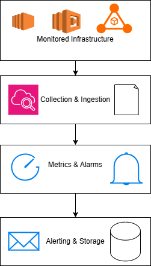

# Serverless AWS Health Monitor 📊🚨

## Project Overview
Infrastructure is only as reliable as the monitoring backing it. Without automated visibility, system failures can go unnoticed, leading to extended downtime and lost revenue.

This project implements a highly scalable, automated health monitoring architecture designed to instantly detect anomalies and route critical alerts to administrators.

## The Architecture

## The Solution
I architected and deployed a comprehensive monitoring stack using Terraform to manage 50 distinct AWS resources. The system follows a logical, event-driven flow:
1. **Collection & Ingestion:** CloudWatch continuously collects logs and metrics from the active infrastructure.
2. **Metrics & Alarms:** Custom CloudWatch Alarms actively evaluate the incoming data against predefined health thresholds.
3. **Alerting & Storage:** When an anomaly is detected, SNS (Simple Notification Service) immediately pushes an alert to the admin team, while logs are concurrently routed to an S3 bucket for long-term audit storage.

## The Business Impact
* **Proactive Incident Response:** Reduced Mean-Time-To-Detection (MTTD) by automating alerts, ensuring the team is notified the second a threshold is breached.
* **Audit Readiness:** Established a secure, long-term log retention strategy using S3, satisfying standard compliance and security audit requirements.

## Core Technologies
* **Cloud Provider:** AWS
* **Infrastructure as Code:** Terraform
* **Monitoring & Observability:** AWS CloudWatch
* **Event Routing:** AWS SNS
* **Storage:** AWS S3
